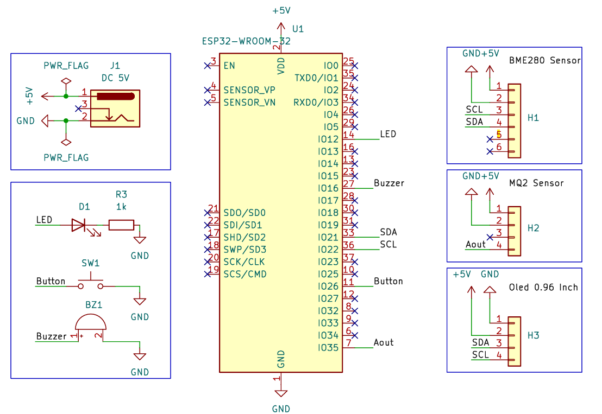
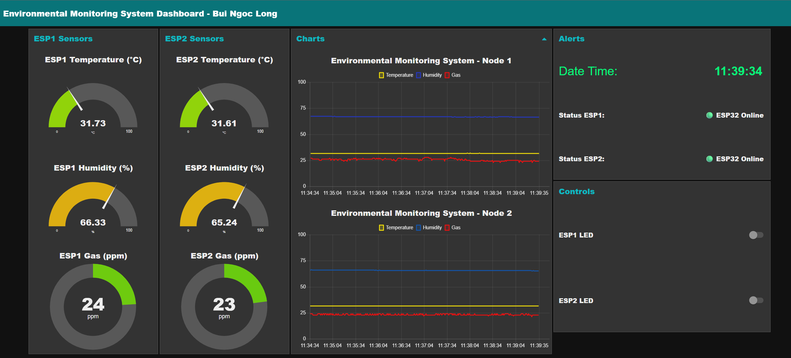

# Low-Cost IoT Environmental Monitoring System

## Overview

This repository contains the source code, documentation, and resources for a low-cost Internet of Things (IoT) system designed for real-time environmental monitoring. The system utilizes two ESP32 nodes equipped with BME280 (temperature, humidity, pressure) and MQ2 (gas) sensors, an OLED LCD for local data display, a Raspberry Pi 4 running a Mosquitto MQTT broker, and Node-RED for data visualization and alerting. The project aims to provide a cost-effective solution for environmental surveillance, smart agriculture, and industrial safety applications.

## Schematic diagram


## Connection Diagram


## NODE Interface


## Features

- Real-time monitoring of temperature, humidity, pressure, and gas levels.
- Local data display on OLED LCD screens.
- Wireless data transmission using MQTT protocol via ESP32 and Mosquitto.
- Web-based dashboard with Node-RED for data visualization and email alerts.
- Edge computing integration for local data processing and reduced latency.
- Open-source framework with hardware and software details.

## System Architecture

- **Hardware**:
  - 2 x ESP32-WROOM microcontrollers.
  - BME280 sensors for temperature, humidity, and pressure.
  - MQ2 gas sensors for detecting gas levels.
  - OLED LCD for local data visualization.
  - Raspberry Pi 4 as the central server.
- **Software**:
  - Mosquitto MQTT broker for data communication.
  - Node-RED for data processing, visualization, and alerting.
  - Arduino IDE for ESP32 programming.
- **Communication**: MQTT protocol with SSL/TLS for secure transmission.

## Installation

### Prerequisites
- Raspberry Pi 4 with Raspberry Pi OS (latest version).
- ESP32 development board and Arduino IDE.
- Node-RED and Mosquitto installed on Raspberry Pi.
- Internet connection for MQTT and email alerting.

### Setup Instructions
1. **Clone the Repository**:
   ```bash
   git clone https://github.com/yourusername/low-cost-iot-monitoring.git
   cd low-cost-iot-monitoring